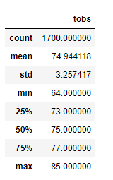
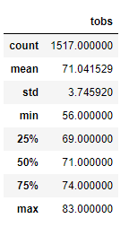

# surfs_up
Week 9 - SQLite, SQLAlchemy and Jupyter

## Overview of the analysis
We have been tasked by W. Avy to analyze temperature trends before the opening of a surf shop in Oahu. The months for the temperature data we are asked to look over are June and December to determine if the surf and ice cream shop we are trying to open will be sustainable year-round.

The below are the results of our findings.

## Results
### June Temperatures Statistical Summary

### December Temperatures Statistical Summary

- According to the summary statistics chart listed for the months of June and December, we see that the minimum temperature for the month of June is 64°, while the minimum temperature for December is 56°.
- Another difference we can see is that there are more counts of temperature observations in the month of June compared to December.
- Finally, the average temperatures for both months are 75° for June and 71° for December respectively.

## Summary
According to our data, there is a great chance of continual sustainability if we were to open the surf and ice cream shop in Oahu. Although the lowest temperature in December was recorded at 56°, the average temperature is still within the 70's. We can also see that the temperatures generally stay relatively the same year-round. This bodes well for us, but there should be additional queries to perform so we can have a complete analysis of our findings. The first possible query we can perform is the amount of precipitation Oahu receives in June and December. Heavy rainfall is seen more in summer months than winter, so this may affect our store and how much traction we may receive. Another query would be how many tourists come throughout the year and whether that would also affect the outcome of the shop.
